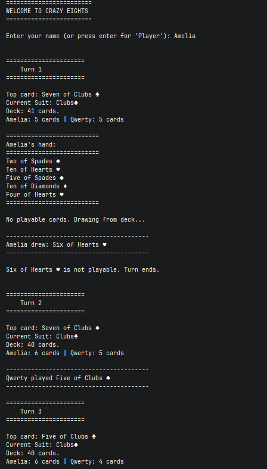
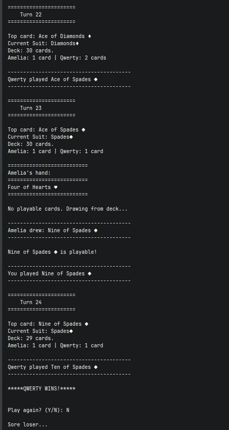

# Crazy Eights

A console-based implementation of the classic card game Crazy Eights, built in C# to demonstrate object-oriented design principles.

## Game Description

Crazy Eights is a two-player card game where the goal is to be the first player to empty your hand. Players take turns matching the top card of the discard pile by either suit or rank. Eights are wild and can be played at any time, allowing the player to declare a new suit.

### Rules

- Each player is dealt 5 cards
- Match the top discard card by **suit** or **rank**
- **Eights are wild** - play anytime and declare a new suit
- If you can't play, draw one card from the deck
- If the drawn card is playable, you may play it immediately
- First player to empty their hand wins
- If the deck runs out, the player with fewer cards wins (or tie if equal)

## Object-Oriented Concepts Demonstrated

| Concept              | Implementation                                               |
| -------------------- | ------------------------------------------------------------ |
| **Interfaces**       | `ICard` defines the contract for cards; `IPlayer` defines the contract for players |
| **Abstract Classes** | `PlayerBase` encapsulates shared player logic (hand management, finding playable cards) |
| **Concrete Classes** | `StandardCard`, `HumanPlayer`, `CpuPlayer`, `Deck`, `DiscardPile`, `CrazyEightsGame` |
| **Polymorphism**     | Players stored as `List<IPlayer>`; game engine calls `TakeTurn()` without knowing player type |
| **Dynamic Dispatch** | `currentPlayer.TakeTurn(context)` resolves to correct implementation at runtime |
| **Encapsulation**    | Private hands, deck, and discard pile; state modified only through methods |


## How to Run

### Prerequisites

- [.NET 10.0 SDK](https://dotnet.microsoft.com/download/dotnet/10.0) or later

### From Command Line

```bash
cd src/CrazyEights
dotnet run
```

### Using Docker

```bash
cd src/CrazyEights
docker build -t crazy-eights .
docker run -it crazy-eights
```

> **Note:** The `-it` flag is required for interactive console input.

## Screenshot

<p align="center">
  
  
</p>

## Author

Amelia Ellingson - KSU SWE 4743: Object-Oriented Design